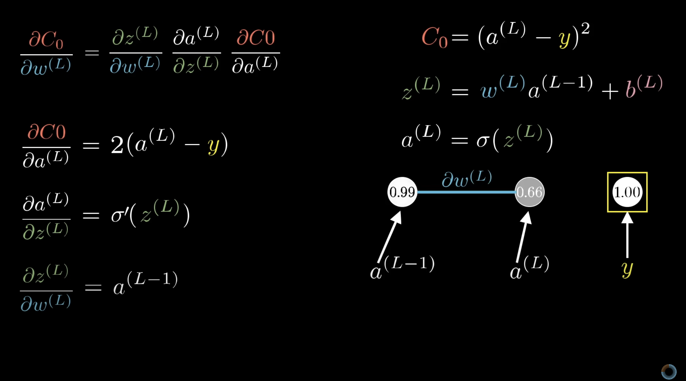
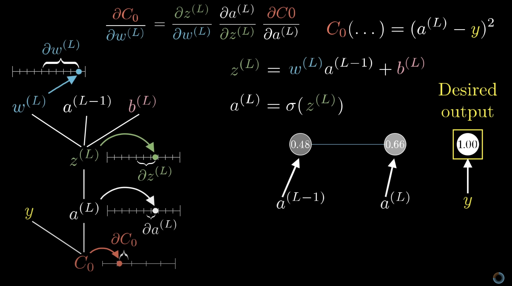
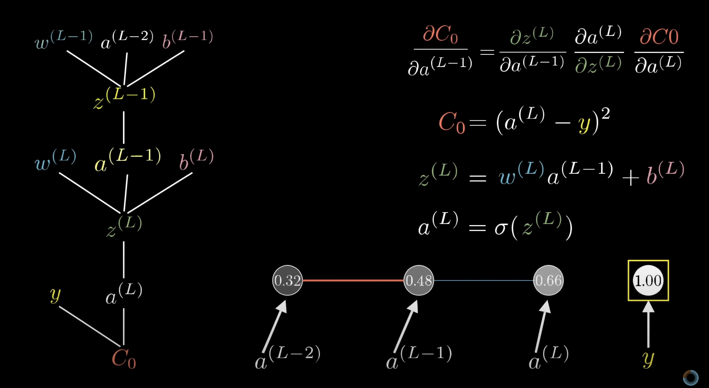
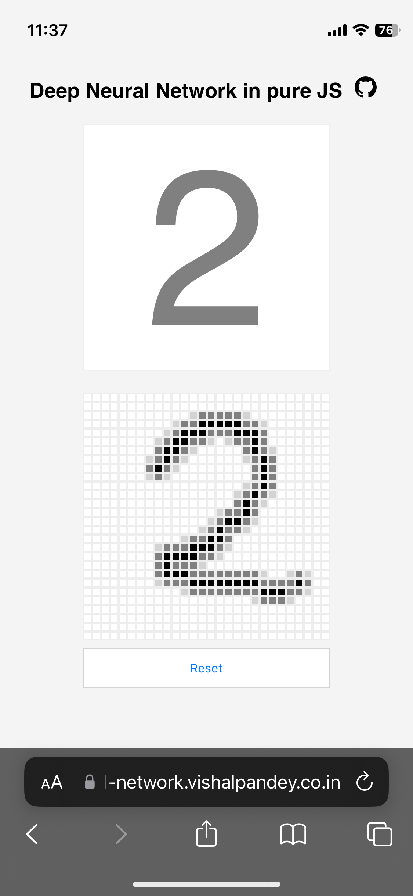

## Deep Neral Network
---

Here I have implemented the Deep Neural Network from scratch without using any library in plain old javascript.  
  
The calculation is inspired by the 3Blue1Brown's video <a href="https://www.youtube.com/watch?v=tIeHLnjs5U8">Backpropagation calculus | Chapter 4, Deep learning</a>
  
  





al  = Activation of last layer  
al1 = Activation of second last layer  
bl = bias of last layer  
wl  = Weight of last layer  
y   = output  
C = Cost function  

### Last Layer Calculations  
C = (al - y)^2  
  
zl = wl * al1 + bl  
al = σ(wl * al1 + bl) = σ(zl)  
  
  
∂C_∂wl = ∂zl_∂wl * ∂al_∂zl * ∂C_∂al  
∂C_∂bl = ∂zl_∂bl * ∂al_∂zl * ∂C_∂al  
  
∂zl_∂wl = al1  
∂al_∂zl = σ`(zl)  
∂C_∂al = 2 * (al - y)  
∂zl_∂bl = 1  
  
∂C_∂wl = al1 * σ'(zl) * 2 * (al - y)  
∂C_∂bl =       σ'(zl) * 2 * (al - y)  
  
  
### Second Last Layer Calculation
zl1 = wl1 * al2 + bl1  
al1 = σ(wl1 * al2 + bl1) = σ(zl)  
  
∂C_∂wl1 = ∂zl1_∂wl1 * ∂al1_∂zl1 * ∂C_∂al1
∂C_∂bl1 = ∂zl1_∂bl1 * ∂al1_∂zl1 * ∂C_∂al1

∂C_∂al1 = ∂zl_∂al1 * ∂al_∂zl * ∂C_∂al


## Application
Since this whole algorithm is implemented in pure javascript, I have made an Front end application where you can draw the digits and model will predict the  what you have drawn.  

<a href="https://neural-network.vishalpandey.co.in/">Link of the application</a>

<a href="https://neural-network.vishalpandey.co.in/"></a>
  
  
## Instruction to train the model locally
  

```
git clone https://github.com/vishal-pandey/deep-neural-network-javascript.git
cd deep-neural-network-javascript
node neural.js
```

You can update the hyper parameters in neural.js file
```
const layers = [16, 16, 10];
const epochs = 5;
```

Weights and biases will be saved in weights.json file, which in turn are read by the frontend application to make the prediction.